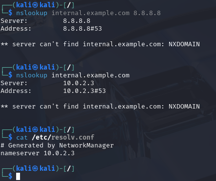
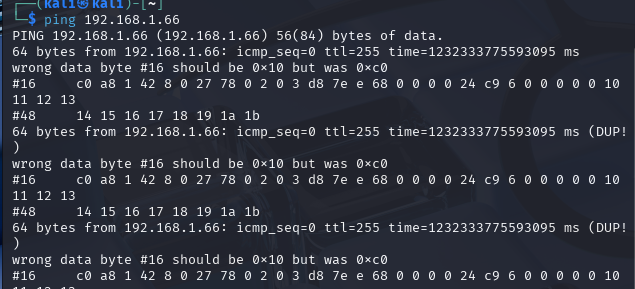
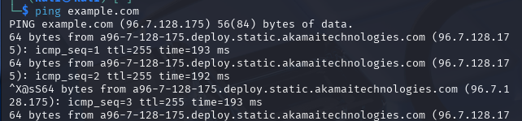

1 - by verifying the dns in /etc/reslv.cof and verifying the 8.8.8.8 dns using nslookup command we get the same result which is no respone (NXDOMAIN) if the respones from our dns and 8.8.8.8 dns are same therefore no expected dns issues as shown in verify dns resolution.png image

2 - Diagnose Service Reachability: get the ip of the service and check the service reachability using telnet if it opens on port 80 or 443 as shown in telnet 80.png and telnet 443.png images

2.1 - Try To Ping the Service :

    To be sure that it isn't anetwork problem we can ping
    the service by the domain name and its ip if they are different
    behaviors occur so may be it is a network problem

3 - Trace the Issue – List All Possible Causes :

DNS server Issues :

    Internal DNS server down or misconfigured
    Incorrect DNS records for internal.example.com
    DNS cache poisoning

Network Configuration Issues :

    Incorrect /etc/resolv.conf settings
    Firewall blocking DNS queries (UDP 53)
    Network segmentation preventing DNS resolution

Service Configuration Issues :

    Web server not properly bound to the hostname
    SSL certificate issues causing rejection
    Load balancer misconfiguration
    Local System Issues
    Incorrect hosts file entries
    Local DNS cache issues
    MTU or packet size problem

4 - Propose and Apply Fixes :

DNS Issues :

Confirmation :

    Different respones from internal DNS and 8.8.8.8 DNS

Fix :

    Update the internal dns records or reload the dns server

Network Issues:

Confirmation :

    no respone come from telnet either 443 or 80  thats mean the service is not up or unreachable

Fix :

    Update the /etc/resolv.conf or network manager settings

Service Configuration Issues :

    Confirmation :

        after you are sure the problem is not DNS or Network issues you should the service configuration

    Fix :

        Update the service configuration or reset it

Local System Issues :

    Confirmation :

        Check hosts file and flash the cache

    Fix :

        Update the hosts file and clear the cahce

Bonus :

Configure a local /etc/hosts entry to bypass DNS for testing :

            Add the ip URL pair inside the /etc/host file
            for example 10.0.0.2 internal.example.com that
            would take you to 10.0.0.2 whenever you hit the
            internal.example.com you can modify the file using
            your desirable editor or using sudo tee -a command
            for instance echo "$IP internal.example.com" | sudo tee -a /etc/hosts

persist DNS server settings using systemd-resolved or NetworkManager :

Persist DNS settings with systemd-resolved :

    sudo mkdir -p /etc/systemd/resolved.conf.d
    echo -e "[Resolve]\nDNS=8.8.8.8 8.8.4.4" | sudo tee /etc/systemd/resolved.conf.d/dns_servers.conf
    sudo systemctl restart systemd-resolved

Persist DNS settings with NetworkManager :

    sudo nmcli con mod "Your Connection Name" ipv4.dns "8.8.8.8 8.8.4.4"
    sudo nmcli con up "Your Connection Name"
